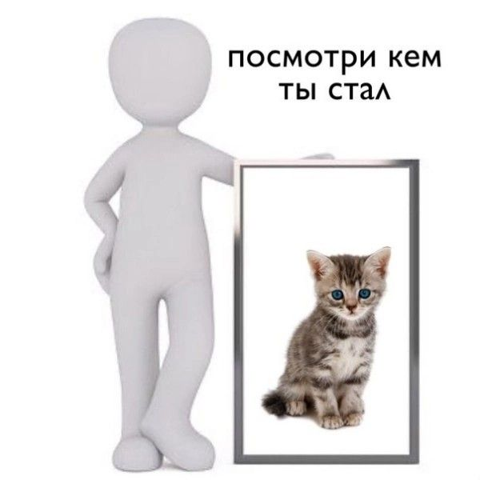

# Site-about-you-
щг789909<!DOCTYPE html>
<html lang="en">
<head>
    <meta charset="UTF-8">
    <meta http-equiv="X-UA-Compatible" content="IE=edge">
    <meta name="viewport" content="width=device-width, initial-scale=1.0">
    <title>Сайт про тебя</title>
    <link rel="icon" href="jpg/910caf2d9a92e175b4459d7fb8736489.jpg" >

    <link rel="stylesheet" href="style.css">
</head>
<body>

    

        

            
            
            
Знаешь.в любом случае я выберу тебя. Что бы между нами не произошло, сколько бы ссор не было бы,сколько раз мы бы не обижали друг друга все равно,ты один из лучших людей в моей жизни. я никогда не смогу забыть тебя.не смотря на все происходящее.. я слишком сильно дорожу твоим присутствием в моей жизни,солнышко 

          
            
               
            </a>
        
        

      

       
            

        

    

    
</body>
</html>
